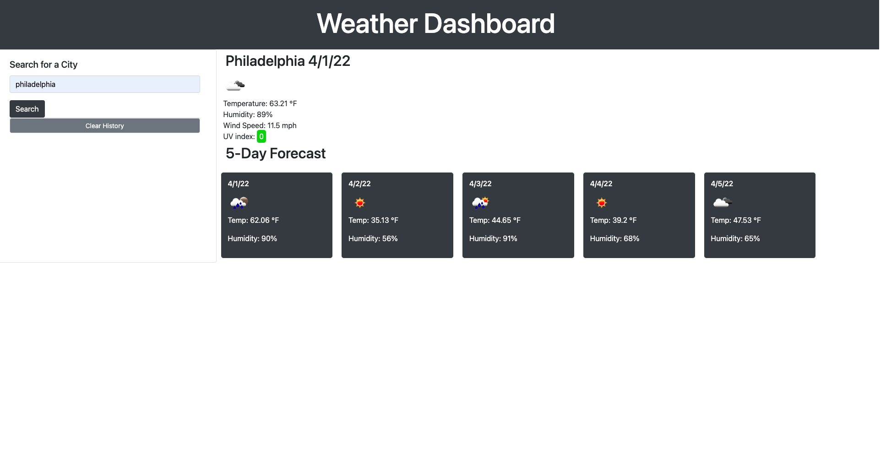

# Weather Dashboard

## Description

This project was a great experiance to work with an api. My motivation for building this was to create something easy to use and gain experiance with making api calls.
The application presents easy to digest data on the current and upcoming weather for the city the user searches.

## Installation

This project can be accessed through the project repository or through the link provided below.  
[Weather Dashboard link](https://nhilde.github.io/weatherDashboard/)

## Usage

To use the application, just type a city into the search bar and submit.

## License

This is licensed under the [MIT License](LICENSE)